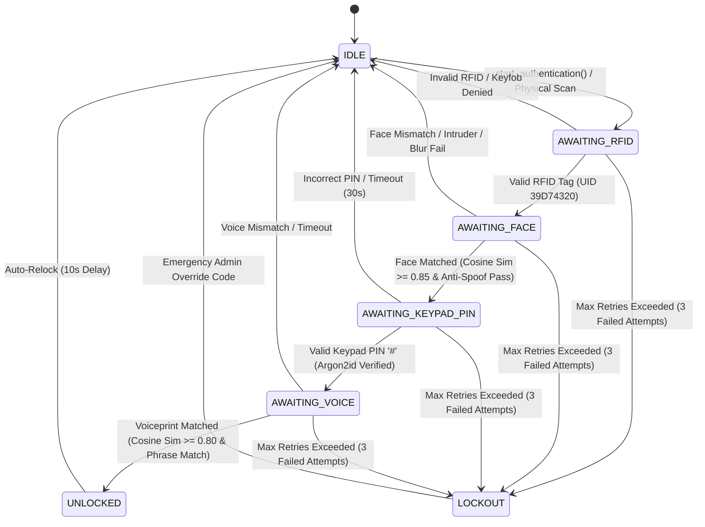
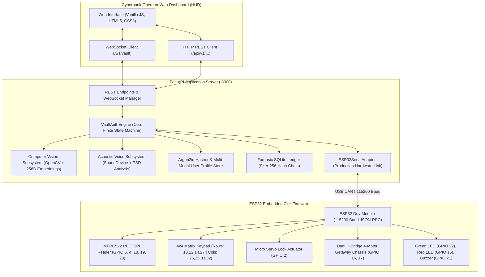
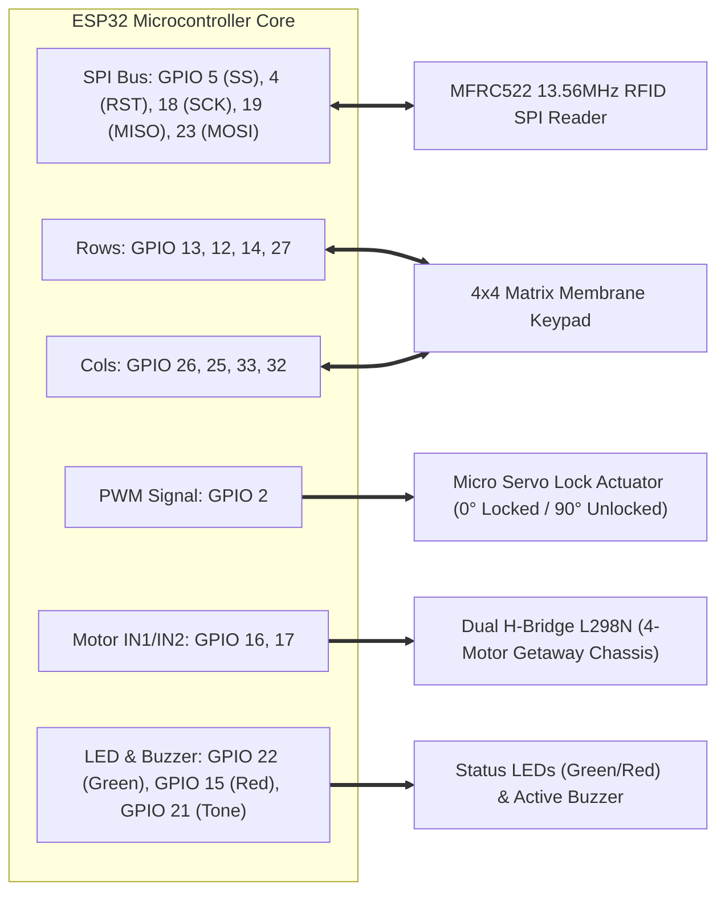

# 🔒 The Inconvenient Vault (Vault-404) 🎯

[](https://www.python.org/)
[](https://fastapi.tiangolo.com/)
[](https://www.arduino.cc/)
[](https://www.sqlalchemy.org/)
[](https://en.wikipedia.org/wiki/Argon2)
[](https://opencv.org/)
[](https://python-sounddevice.readthedocs.io/)

> An intentionally over-engineered multi-modal physical security vault driven by an ESP32 microcontroller, OpenCV computer vision, acoustic microphone feature analysis, Argon2id cryptography, and a tamper-evident SHA-256 hash-chained audit ledger.

## Basic Details
### Team Name: Eclipse

### Team Members
- Team Lead: Blessy mol charls  - Muthoot Institute of Technology and Science
- Member 2: V M Samerath Kumar - Muthoot Institute of Technology and Science

### Project Description
An intentionally over-engineered, hardware-decoupled, 4-stage sequential authentication system backed by computer vision embeddings, acoustic speech feature analysis, Argon2id cryptography, and tamper-evident SHA-256 hash-chained audit trails.

### The Problem (that doesn't exist)
Opening physical boxes and vaults is simply too easy and convenient. People can just use a single key, or worse, just pull a handle. This lack of friction means anyone can access their own belongings without going through a grueling, multi-modal biometric and cryptographic gauntlet.

### The Solution (that nobody asked for)
We built a sequential 4-stage authentication system (RFID -> Face Scan -> Keypad Password -> Voice Phrase) that forces the user to prove their identity in four distinct ways before a servo lock actuator is disengaged and a 4-motor getaway chassis is triggered. If they fail any step, they get locked out!

## Technical Details
### Technologies/Components Used
For Software:
- **Languages used**: Python 3.10+, JavaScript (Vanilla), HTML5, CSS3, C/C++
- **Frameworks used**: FastAPI
- **Libraries used**: OpenCV, SQLAlchemy 2.0, SoundDevice, Argon2-cffi, WebSockets
- **Tools used**: PlatformIO, pytest, Arduino IDE

For Hardware:
- **List main components**: ESP32 Dev Module Microcontroller, MFRC522 RFID 13.56MHz SPI Reader, 4x4 Matrix Membrane Keypad, Micro Servo 9g Lock Actuator, Dual H-Bridge Motor Driver (L298N) with 4-Motor Getaway Chassis, Active Buzzer Module, Green Status LED, Red Status LED
- **List specifications**: 13.56MHz SPI RFID (Mifare 1KB), 16-Key Matrix Matrix Scan, 50Hz PWM Servo Angle Actuation, 115200 Baud Framed JSON-RPC UART
- **List tools required**: Arduino IDE / PlatformIO for ESP32 firmware flashing, USB-to-UART bridge

### Implementation
For Software:
# Installation
```bash
# Clone the repository
git clone https://github.com/bless/vault-404.git
cd vault-404

# Create and activate virtual environment
python -m venv .venv
# On Windows:
.venv\Scripts\activate
# On Linux/macOS:
source .venv/bin/activate

# Install dependencies
pip install -r requirements.txt
```

# Run
```bash
# Running the Interactive CLI Terminal Simulator
python cli_simulator.py

# Running the Web Operator HUD & FastAPI Server
uvicorn app.main:app --host 0.0.0.0 --port 8000 --reload
```
Open **`http://localhost:8000`** in your browser to access the Cyberpunk Operator Console.

### Project Documentation
For Software:

# Screenshots
| Cyberpunk Live Operator HUD | Multi-Modal Sensor Ingestion |
| :---: | :---: |
|  | *Real-time Stage Progression, Hardware Telemetry Stream, and Cryptographic Audit Log Ledger* |

# Diagrams

### 1. Finite State Machine (FSM) Sequential Authentication Gauntlet


### 2. End-to-End System Architecture


### 3. ESP32 Hardware Wiring & Peripheral Interconnect


## 🏛️ Physical Hardware Architecture

**Sequential Authentication Pipeline**
| Stage | Expected Input | Validation Mechanics | Threshold / Criteria | Fail-Secure Action |
| :--- | :--- | :--- | :--- | :--- |
| **0: IDLE** | Operator triggers `start_authentication()` or presents physical RFID card | Checks that vault is in clean standby state. | None | Rejects input if locked out. |
| **1: RFID** | 13.56MHz Mifare Tag UID (Hex) | Evaluates UID against authorized allowlist & enrolled database profile (`39D74320`). Keyfobs rejected. | Exact String Match | Decrements retry count; advances to Stage 2 on match. |
| **2: Face Scan** | Webcam Stream Frame (H, W, 3) | Extracts 256D normalized vector; evaluates cosine similarity and Laplacian blur sharpness anti-spoofing. | Cosine Sim $\ge 0.85$, Variance $\ge 15.0$ | Decrements retry count; rejects spoof / blur. |
| **3: Keypad PIN** | 4x4 Matrix Keypad Input (Terminated by `#`) | Verifies entered PIN string against enrolled Argon2id cryptographic hash. | Argon2id Hash Match | Decrements retry count; advances to Stage 4. |
| **4: Voice** | Acoustic Waveform + Spoken Phrase | Computes 256D spectral voiceprint and verifies both speaker timbre and challenge phrase (`OPEN SESAME OVERENGINEERED`). | Cosine Sim $\ge 0.80$ & Exact Phrase Match | Disengages lock servo; triggers getaway motors; sets state to `UNLOCKED`. |
| **UNLOCKED** | Standby / Disengaged | Holds lock open for 10 seconds while getaway motors propel chassis. | Auto-relock timer (10s) | Auto-engages servo lock and resets to `IDLE`. |

## 🔌 ESP32 Pinout & Wiring Matrix

| Peripheral Component | Pin Name | ESP32 GPIO | Electrical / Protocol Notes |
| :--- | :--- | :--- | :--- |
| **MFRC522 RFID Reader** | SDA(SS) / SCK / MOSI / MISO / RST | **GPIO 5, 18, 23, 19, 4** | SPI Bus ($3.3\text{V}$ Logic & Power) |
| **4x4 Matrix Keypad** | Row 1 / Row 2 / Row 3 / Row 4 | **GPIO 13, 12, 14, 27** | Driven as sequential scan outputs |
| | Col 1 / Col 2 / Col 3 / Col 4 | **GPIO 26, 25, 33, 32** | Read as inputs with internal pull-ups |
| **Lock Servo Actuator** | PWM Signal | **GPIO 2** | `0°` = Locked, `90°` = Unlocked (50Hz PWM, 5V VCC) |
| **Status Green LED** | Granted / Success | **GPIO 22** | Active-High with 220Ω current limiting resistor |
| **Status Red LED** | Denied / Alarm | **GPIO 15** | Active-High with 220Ω current limiting resistor |
| **Active Buzzer** | Audio Tone & Chirp | **GPIO 21** | PWM tone generator (1000Hz, 2000Hz, etc.) |
| **4-Motor Getaway Driver**| IN1 / IN2 (Left/Right Motors) | **GPIO 16, 17** | Dual H-Bridge Motor Driver (L298N / TB6612FNG) |

---

## 🚀 Quickstart & Deployment Guide

### 1. Python Environment Setup
```powershell
# Create and activate virtual environment
python -m venv .venv
.venv\Scripts\activate

# Install dependencies
pip install -r requirements.txt

# Configure environment variables (.env)
cp .env.example .env
# Set your actual vault password in .env:
# VAULT_PASSWORD=YourSecretPassword123!
```

### 2. Flashing the ESP32 (Arduino IDE)
1. Open **Arduino IDE**.
2. Open the sketch: [`firmware/arduino_vault/arduino_vault.ino`](file:///c:/Users/bless/GIT/vault-404/firmware/arduino_vault/arduino_vault.ino).
3. Install required libraries from Library Manager (`Ctrl + Shift + I`):
   - `Keypad` by Mark Stanley, Alexander Brevig
   - `ESP32Servo` by Kevin Harrington
   - `MFRC522` by GithubCommunity / miguelbalboa
   - `ArduinoJson` by Benoit Blanchon (v7.x or v6.x)
4. Select Board: **ESP32 Dev Module**.
5. Select Port: (e.g. `COM3` on Windows or `/dev/ttyUSB0` on Linux).
6. Click **Upload**.

### 3. Run Physical Hardware Diagnostic Suite
Test all physical hardware peripherals interactively:
```powershell
python test_hardware_live.py
```
*(To test without waiting for physical inputs: `python test_hardware_live.py --dry-run`)*

### 4. Run the Vault-404 Backend Server & Web Terminal
```powershell
# Set your secure password:
$env:VAULT_PASSWORD="YourSecretPassword123!"
python -m uvicorn app.main:app --host 127.0.0.1 --port 8000 --reload
```
Open **[http://127.0.0.1:8000](http://127.0.0.1:8000)** to view the live security terminal.

### 5. Automated Tests
```powershell
python -m pytest test_password_auth_architecture.py test_keypad_hardware_integration.py
```

For Hardware:

# Schematic & Circuit
**Hardware Deployment Guide (ESP32 Integration)**
| Peripheral Component | Pin Name | ESP32 GPIO | Notes |
| :--- | :--- | :--- | :--- |
| **MFRC522 RFID Reader** | SDA / SS | **GPIO 5** | SPI Chip Select |
| | SCK | **GPIO 18** | SPI Clock |
| | MOSI | **GPIO 23** | SPI Master Out |
| | MISO | **GPIO 19** | SPI Master In |
| | RST | **GPIO 4** | Reset Pin |
| | 3.3V / GND | 3.3V / GND | **Do not power with 5V** |
| **4x4 Matrix Keypad** | Rows 1..4 | **GPIO 13, 12, 14, 27** | Matrix Scan Rows |
| | Cols 1..4 | **GPIO 26, 25, 33, 32** | Matrix Scan Cols |
| **Lock Servo Actuator** | Signal | **GPIO 2** | 50Hz PWM Servo Actuator (5V Power) |
| **Getaway Motor Driver**| IN1 / IN2 | **GPIO 16, 17** | L298N Dual H-Bridge Motor Control |
| **Status Green LED** | Anode | **GPIO 22** | Access Granted Indicator |
| **Status Red LED** | Anode | **GPIO 15** | Access Denied / Alarm Indicator |
| **Active Buzzer** | SIG | **GPIO 21** | Audio Feedback & Audible Alarm |

# Build Photos


### Project Demo
# Video
[Add your demo video link here]
*Explain what the video demonstrates*

# Additional Demos
[Add any extra demo materials/links]

## Additional Project Details

### Software-First / Simulation Strategy
The vault is designed with zero physical hardware dependencies during software engineering and automated CI/CD:
1. **`MockHardwareAdapter`**: Emulates solenoid relay actuation, status LCD lines, RGB LEDs, and buzzer alarms completely in-memory.
2. **`MockCameraAdapter`**: Synthetically renders parameterized facial portraits with distinct skin tones, facial geometry, focus blurs, and sensor noise based on deterministic seeds (e.g. `Seed 777` for authorized operator, `Seed 999` for intruder).
3. **`MockAudioAdapter`**: Synthesizes vocal pitch fundamentals ($F_0$), vocal tract formant resonances ($F_1, F_2, F_3$), syllable amplitude envelopes, and acoustic noise based on speaker seeds (e.g. `Seed 1` for operator, `Seed 2` for intruder).

### Forensic Audit Trails & Hash Chain Verification
Every security event is logged in SQLite with cryptographic SHA-256 chaining:
$$\text{EntryHash}_n = \text{SHA256}(\text{EntryHash}_{n-1} \parallel \text{Timestamp} \parallel \text{UserID} \parallel \text{Stage} \parallel \text{EventType} \parallel \text{Metadata})$$

**Verifying Chain Integrity Programmatically:**
```python
import asyncio
from app.database.session import create_database_engine, create_session_factory
from app.database.repository import SqliteVaultRepository

async def verify():
    engine = create_database_engine("sqlite+aiosqlite:///vault.db")
    sf = create_session_factory(engine)
    repo = SqliteVaultRepository(sf)
    is_valid, error = await repo.verify_audit_trail_integrity()
    print(f"Audit Trail Integrity: {'VALID' if is_valid else 'CORRUPTED'}")
    if error:
        print(f"Tamper details: {error}")
    await engine.dispose()

asyncio.run(verify())
```

### Comprehensive Automated Test Suite
Run the full pytest suite (66 tests covering all 10 architectural steps):
```bash
pytest -v
```

### Repository Structure
```
vault-404/
├── app/
│   ├── adapters/                  # Hardware & Simulation Adapters
│   ├── api/                       # FastAPI REST & WebSocket Routing
│   ├── audio/                     # Acoustic Signal Processing Subsystem
│   ├── core/                      # Core FSM & Domain Definitions
│   ├── database/                  # SQLite Persistence & Hash-Chained Audit Logs
│   ├── interfaces/                # Abstract Hardware & Subsystem Contracts (ABCs)
│   ├── static/                    # Cyberpunk Web Operator Console
│   └── vision/                    # Computer Vision Subsystem
├── firmware/                      # ESP32 Embedded Microcontroller Project
├── cli_simulator.py               # Terminal Interactive ANSI CLI Testing Harness
├── requirements.txt               # Locked Production Dependencies
├── test_step1.py ... test_step10.py # Comprehensive Automated Test Suites
└── README.md                      # Production Documentation
```

## Team Contributions

- **[Blessy Mol Charls](https://github.com/Blessymolcharls)** (Lead Software & Hardware Integration):
  - **Core Architecture & FSM**: Designed and implemented the asynchronous `VaultAuthEngine` finite state machine, handling sequential stage transitions, retry counters, security lockouts, and auto-relock delays.
  - **FastAPI Backend & WebSockets**: Built the asynchronous REST API and real-time WebSocket telemetry engine (`/ws/vault`) for instantaneous sensor streaming and bidirectional state sync.
  - **Biometrics & DSP Subsystems**: Developed the OpenCV computer vision face verification pipeline with Laplacian blur anti-spoofing, and the acoustic signal processing module with spectral voiceprint feature extraction.
  - **Security & Cryptographic Persistence**: Implemented Argon2id password verification, SQLite repository with SQLAlchemy 2.0 async sessions, and tamper-evident SHA-256 hash-chained forensic audit trail verification.
  - **Hardware Interfacing & Firmware**: Developed the `ESP32SerialAdapter` high-speed UART JSON-RPC protocol, Arduino/ESP32 C++ firmware logic, MFRC522 RFID SPI driver, 4x4 matrix keypad scanning, micro-servo lock PWM actuation, and L298N motor driver control.
  - **Testing & Diagnostics**: Authored the interactive live hardware diagnostic suite (`test_hardware_live.py`) and automated pytest verification suites.

- **[V M Samerath Kumar](https://github.com/estatic-coder)** (Software, UI & Mechanical Assembly):
  - **Android Companion App**: Built the native Android Kotlin companion application (`mobile/android/`) using Jetpack Compose, Retrofit REST client integration (`VaultApi.kt`), and local cryptographic utility helpers (`CryptoHelper.kt`).
  - **Frontend UI & Styling**: Contributed to Cyberpunk Web Operator HUD styling, CSS theming (`dashboard.css`), dashboard template structure (`index.html`), and client state integration (`vault_client.js`).
  - **Test Scripting & Automation**: Created automated test execution helpers, API schema validation scripts, and test suite maintenance harnesses.
  - **Mechanical Fabrication & Assembly**: Assembled the physical vault enclosure, chassis framework, and structural mounting for lock servos and motor brackets.

---
Made with ❤️ at TinkerHub Useless Projects
