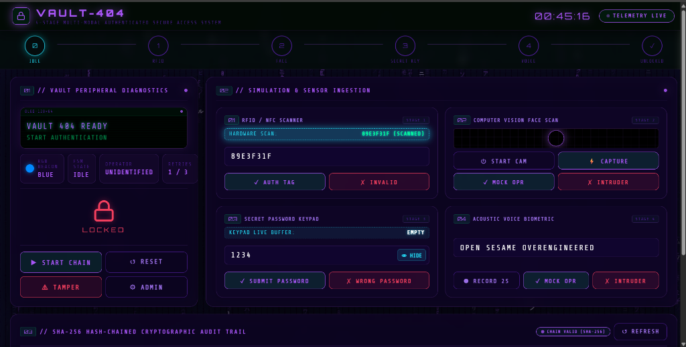
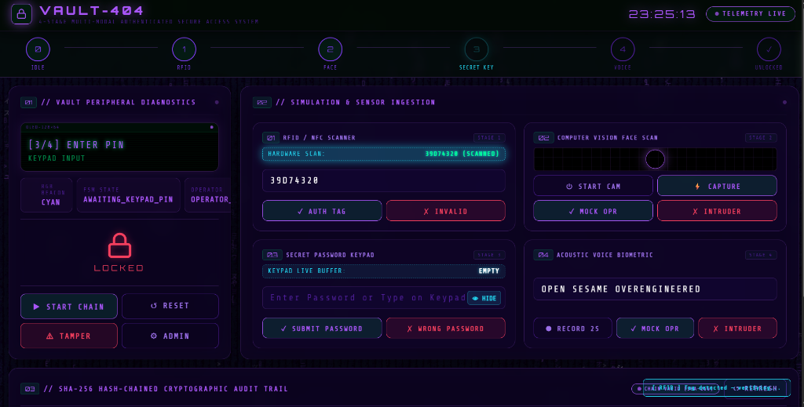
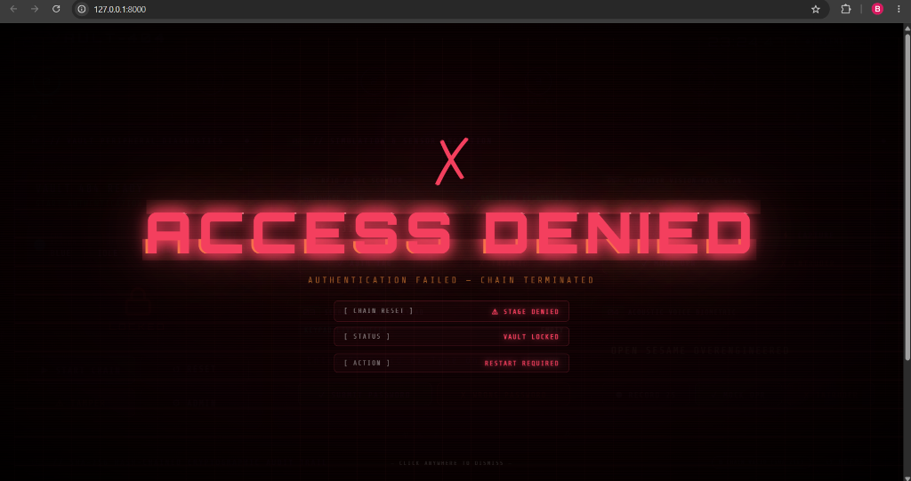
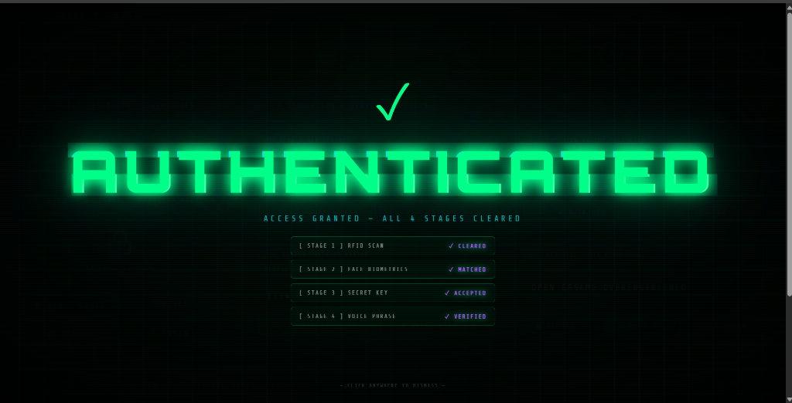
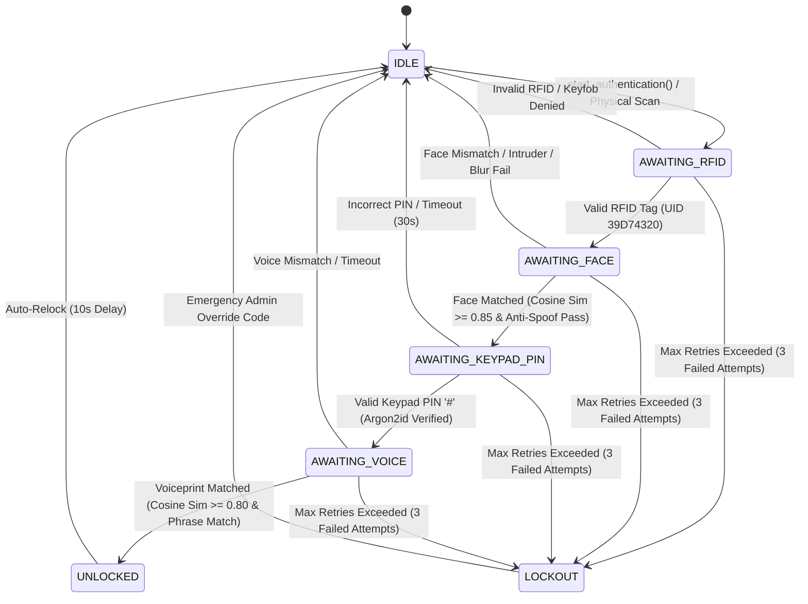
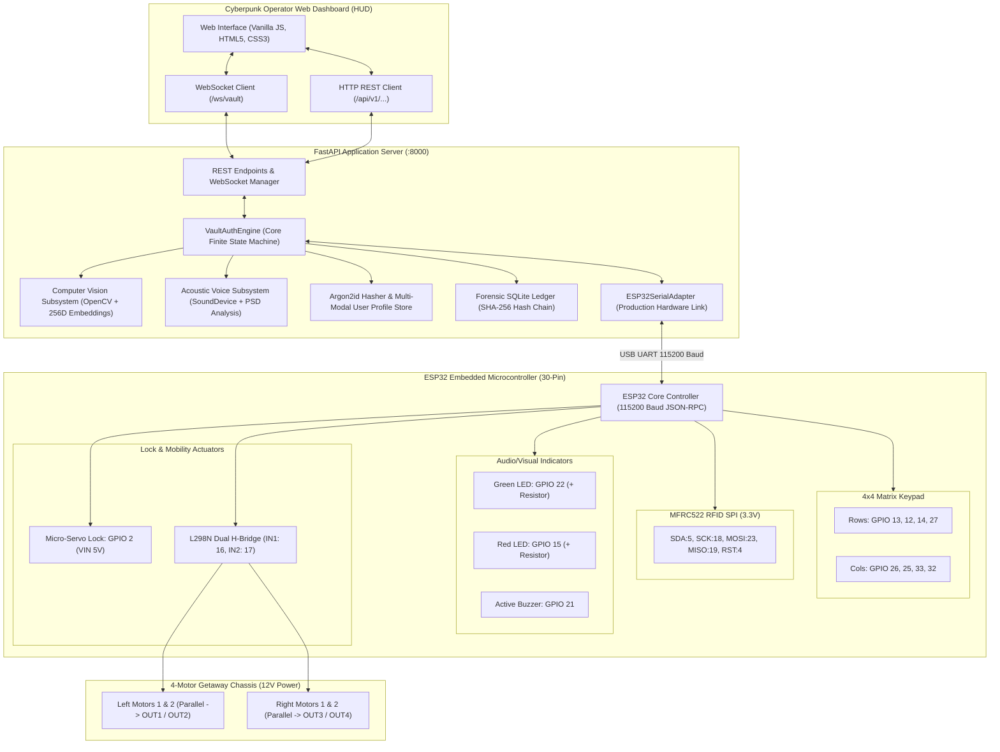
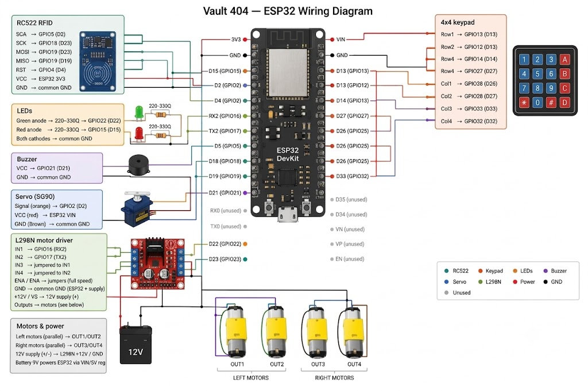
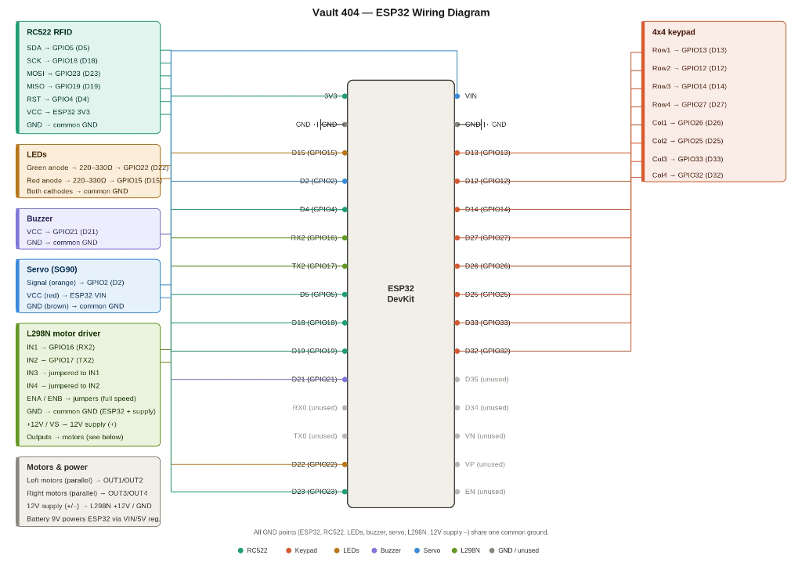

# 🔒 The Inconvenient Vault (Vault-404) 🎯

[](https://www.python.org/)
[](https://fastapi.tiangolo.com/)
[](https://www.arduino.cc/)
[](https://www.sqlalchemy.org/)
[](https://en.wikipedia.org/wiki/Argon2)
[](https://opencv.org/)
[](https://python-sounddevice.readthedocs.io/)

> An intentionally over-engineered multi-modal physical security vault driven by an ESP32 microcontroller, OpenCV computer vision, acoustic microphone feature analysis, Argon2id cryptography, and a tamper-evident SHA-256 hash-chained audit ledger.

## Basic Details
### Team Name: Eclipse

### Team Members
- Team Lead: Blessy mol charls  - Muthoot Institute of Technology and Science
- Member 2: V M Samerath Kumar - Muthoot Institute of Technology and Science

### Project Description
**Vault-404** is an intentionally over-engineered multi-factor security vault combining IoT, 13.56MHz RFID, OpenCV face recognition, matrix keypad PIN authentication, acoustic voice verification, and SHA-256 cryptographic audit logging.

The authentication process enforces a strict sequential pipeline:
$$\text{RFID} \longrightarrow \text{Face Verification} \longrightarrow \text{Keypad PIN} \longrightarrow \text{Voice Verification}$$

- **Multi-Modal Biometrics**: Face verification includes Laplacian variance anti-spoofing analysis, while the acoustic engine verifies speaker timbre and passphrases.
- **Cryptographic Rigor**: Matrix keypad PINs are verified using memory-hard **Argon2id** hashing.
- **Physical Getaway Actuation**: Once all authentication factors are cleared, the servo lock actuator disengages, and the 4-motor getaway chassis physically propels the vault away to reveal the secured contents.
- **Fail-Secure Defense**: Any invalid input, out-of-order stage submission, or timeout triggers immediate sequence termination, security lockout, and audible buzzer alarms.
- **Tamper-Evident Ledger**: A FastAPI backend manages the asynchronous finite state machine while the ESP32 controls hardware peripherals over high-speed JSON-RPC UART, logging every event into a cryptographic SHA-256 hash-chained SQLite audit ledger.

*Vault-404 turns authentication into a physical experience: prove your identity, and the vault literally gets out of your way.*

### The Problem (that doesn't exist)
Most security systems are designed to make valuable objects safer and easier to access for authorized users. However, over-engineering a system can make it unnecessarily complex, inconvenient, and impractical.

**Vault-404** addresses this completely unnecessary problem: *how to make a useless vault as difficult as possible to access.* The vault enforces an arduous four-step verification gauntlet to authenticate the user, despite possessing a minuscule storage capacity that cannot practically hold anything useful. To maximize inconvenience, even after the operator successfully clears all four biometric and cryptographic gauntlets, the vault activates motorized wheels and literally drives away from the user.

This project deliberately showcases the absurdity of excessive security, extreme multi-modal verification, and engineering complexity when there is zero practical justification.

### The Solution (that nobody asked for)
**Vault-404 is an intentionally over-engineered security system designed to solve a completely unnecessary problem.**

The vault uses four-step user verification before granting access. Once all four authentication stages are successfully completed, instead of simply opening, the vault activates its motors and physically moves away from the user.

Combined with its small and impractical storage space, the system makes the entire authentication process unnecessarily complicated and pointless.

The solution demonstrates the humorous concept of over-engineering, where advanced security and automation are implemented without considering practicality or user convenience.

*Vault-404 doesn't just secure your belongings — it makes sure you can't reach them.*

## Technical Details
### Technologies/Components Used
For Software:
- **Languages used**: Python 3.10+, JavaScript (Vanilla), HTML5, CSS3, C/C++
- **Frameworks used**: FastAPI
- **Libraries used**: OpenCV, SQLAlchemy 2.0, SoundDevice, Argon2-cffi, WebSockets
- **Tools used**: PlatformIO, pytest, Arduino IDE

For Hardware:
- **List main components**: ESP32 Dev Module Microcontroller, MFRC522 RFID 13.56MHz SPI Reader, 4x4 Matrix Membrane Keypad, Micro Servo 9g Lock Actuator, Dual H-Bridge Motor Driver (L298N) with 4-Motor Getaway Chassis, Active Buzzer Module, Green Status LED, Red Status LED
- **List specifications**: 13.56MHz SPI RFID (Mifare 1KB), 16-Key Matrix Matrix Scan, 50Hz PWM Servo Angle Actuation, 115200 Baud Framed JSON-RPC UART
- **List tools required**: Arduino IDE / PlatformIO for ESP32 firmware flashing, USB-to-UART bridge

### Implementation
For Software:
# Installation
```bash
# Clone the repository
git clone https://github.com/bless/vault-404.git
cd vault-404

# Create and activate virtual environment
python -m venv .venv
# On Windows:
.venv\Scripts\activate
# On Linux/macOS:
source .venv/bin/activate

# Install dependencies
pip install -r requirements.txt
```

# Run
```bash
# Running the Interactive CLI Terminal Simulator
python cli_simulator.py

# Running the Web Operator HUD & FastAPI Server
uvicorn app.main:app --host 0.0.0.0 --port 8000 --reload
```
Open **`http://localhost:8000`** in your browser to access the Cyberpunk Operator Console.

### Project Documentation
For Software:

# Screenshots

#### 1. Cyberpunk Live Operator Dashboard (Standby & Diagnostic HUD)

> *The central command console showing live WebSocket telemetry, peripheral diagnostics, stage progression track, multi-modal sensor ingestion panels (RFID, Face CV, Keypad PIN, Acoustic Voice), and the SHA-256 hash-chained forensic audit trail.*

#### 2. Sequential Stage Progression — Stage 3: Awaiting Keypad PIN

> *Live hardware synchronization during Stage 3 (`AWAITING_KEYPAD_PIN`). The OLED display prompts for matrix keypad input while the live buffer securely captures keystrokes until terminated by `#` for Argon2id cryptographic verification.*

#### 3. Access Denied & Security Chain Termination Overlay

> *Immediate fail-secure reaction when unauthorized credentials (e.g. keyfob UID or incorrect PIN) are submitted. The entire sequence is terminated, the servo lock remains engaged, and the system resets to standby.*

#### 4. Authenticated Clearance & Actuator Release Overlay

> *Visual confirmation when all 4 sequential security stages are successfully cleared (`RFID Scan ✓`, `Face Biometrics ✓`, `Secret Key ✓`, `Voice Phrase ✓`), disengaging the servo lock actuator and triggering the 4-motor getaway chassis.*

---

# Diagrams

### 1. Finite State Machine (FSM) Sequential Authentication Gauntlet


### 2. End-to-End System Architecture


### 3. ESP32 Hardware Wiring & Pin Interconnect Matrix

#### Visual Component Wiring Diagram
<p align="center">
  
  <br>
  <em>Figure 3.1: Complete Physical Component Wiring Schematic (ESP32 DevKit, RC522 RFID, 4x4 Keypad, SG90 Servo, L298N Motor Driver, 4 DC Motors, Status LEDs & Active Buzzer)</em>
</p>

#### Circuit Schematic Overview
<p align="center">
  
  <br>
  <em>Figure 3.2: ESP32 Pin Assignment & Bus Interconnect Schematic</em>
</p>

#### Mermaid Pin Routing

```mermaid
graph TD
    subgraph ESP32_Left["ESP32 Left Header"]
        P_3V3["3V3 Rail"]
        P_GND1["GND"]
        P_D15["GPIO 15 (D15)"]
        P_D2["GPIO 2 (D2)"]
        P_D4["GPIO 4 (D4)"]
        P_D5["GPIO 5 (D5)"]
        P_D18["GPIO 18 (D18)"]
        P_D19["GPIO 19 (D19)"]
        P_D21["GPIO 21 (D21)"]
        P_D22["GPIO 22 (D22)"]
        P_D23["GPIO 23 (D23)"]
        P_GPIO16["GPIO 16 (RX2)"]
        P_GPIO17["GPIO 17 (TX2)"]
    end

    subgraph ESP32_Right["ESP32 Right Header"]
        P_VIN["VIN (5V Rail)"]
        P_GND2["GND"]
        P_D13["GPIO 13 (D13)"]
        P_D12["GPIO 12 (D12)"]
        P_D14["GPIO 14 (D14)"]
        P_D27["GPIO 27 (D27)"]
        P_D26["GPIO 26 (D26)"]
        P_D25["GPIO 25 (D25)"]
        P_D33["GPIO 33 (D33)"]
        P_D32["GPIO 32 (D32)"]
    end

    subgraph Keypad["4x4 Membrane Keypad"]
        KR1["Row 1 (Pin 1)"]
        KR2["Row 2 (Pin 2)"]
        KR3["Row 3 (Pin 3)"]
        KR4["Row 4 (Pin 4)"]
        KC1["Col 1 (Pin 5)"]
        KC2["Col 2 (Pin 6)"]
        KC3["Col 3 (Pin 7)"]
        KC4["Col 4 (Pin 8)"]
    end

    subgraph RFID["RC522 RFID Reader (SPI)"]
        R_SDA["SDA / SS"]
        R_SCK["SCK"]
        R_MOSI["MOSI"]
        R_MISO["MISO"]
        R_RST["RST"]
        R_VCC["3.3V VCC"]
        R_GND["GND"]
    end

    subgraph Indicators["AV Signaling"]
        LED_GREEN["Green LED (+ 220Ω Resistor)"]
        LED_RED["Red LED (+ 220Ω Resistor)"]
        BUZZER["Active Buzzer (5V / PWM)"]
    end

    subgraph LockActuator["Lock Mechanism"]
        SERVO_SIG["Servo Signal (Orange)"]
        SERVO_PWR["Servo VCC (Red) -> VIN 5V"]
        SERVO_GND["Servo GND (Brown/Black)"]
    end

    subgraph MotorDriver["L298N Dual H-Bridge Driver"]
        L_IN1["IN1 (Left Forward)"]
        L_IN2["IN2 (Left Reverse)"]
        L_IN3["IN3 (Jumpered to IN1)"]
        L_IN4["IN4 (Jumpered to IN2)"]
        L_VS["+12V / VS (12V Supply +)"]
        L_GND["GND (Common Ground)"]
        L_ENA["ENA (Jumper Installed)"]
        L_ENB["ENB (Jumper Installed)"]
        L_OUT12["OUT1 & OUT2 (Left Motor Bank)"]
        L_OUT34["OUT3 & OUT4 (Right Motor Bank)"]
    end

    subgraph Motors["4-Motor Getaway Chassis"]
        LM12["Left Motors 1 & 2 (Parallel)"]
        RM12["Right Motors 1 & 2 (Parallel)"]
    end

    %% Keypad Interconnects
    P_D13 --- KR1
    P_D12 --- KR2
    P_D14 --- KR3
    P_D27 --- KR4
    P_D26 --- KC1
    P_D25 --- KC2
    P_D33 --- KC3
    P_D32 --- KC4

    %% RFID Interconnects
    P_D5 --- R_SDA
    P_D18 --- R_SCK
    P_D23 --- R_MOSI
    P_D19 --- R_MISO
    P_D4 --- R_RST
    P_3V3 --- R_VCC
    P_GND1 --- R_GND

    %% Status Indicators
    P_D22 --- LED_GREEN
    P_D15 --- LED_RED
    P_D21 --- BUZZER

    %% Servo Actuator
    P_D2 --- SERVO_SIG
    P_VIN --- SERVO_PWR
    P_GND2 --- SERVO_GND

    %% L298N Motor Driver
    P_GPIO16 --- L_IN1
    P_GPIO17 --- L_IN2
    L_IN1 -.->|Jumper| L_IN3
    L_IN2 -.->|Jumper| L_IN4
    P_GND1 --- L_GND
    L_OUT12 ==> LM12
    L_OUT34 ==> RM12
```


## 🏛️ Physical Hardware Architecture

**Sequential Authentication Pipeline**
| Stage | Expected Input | Validation Mechanics | Threshold / Criteria | Fail-Secure Action |
| :--- | :--- | :--- | :--- | :--- |
| **0: IDLE** | Operator triggers `start_authentication()` or presents physical RFID card | Checks that vault is in clean standby state. | None | Rejects input if locked out. |
| **1: RFID** | 13.56MHz Mifare Tag UID (Hex) | Evaluates UID against authorized allowlist & enrolled database profile (`39D74320`). Keyfobs rejected. | Exact String Match | Decrements retry count; advances to Stage 2 on match. |
| **2: Face Scan** | Webcam Stream Frame (H, W, 3) | Extracts 256D normalized vector; evaluates cosine similarity and Laplacian blur sharpness anti-spoofing. | Cosine Sim $\ge 0.85$, Variance $\ge 15.0$ | Decrements retry count; rejects spoof / blur. |
| **3: Keypad PIN** | 4x4 Matrix Keypad Input (Terminated by `#`) | Verifies entered PIN string against enrolled Argon2id cryptographic hash. | Argon2id Hash Match | Decrements retry count; advances to Stage 4. |
| **4: Voice** | Acoustic Waveform + Spoken Phrase | Computes 256D spectral voiceprint and verifies both speaker timbre and challenge phrase (`OPEN SESAME OVERENGINEERED`). | Cosine Sim $\ge 0.80$ & Exact Phrase Match | Disengages lock servo; triggers getaway motors; sets state to `UNLOCKED`. |
| **UNLOCKED** | Standby / Disengaged | Holds lock open for 10 seconds while getaway motors propel chassis. | Auto-relock timer (10s) | Auto-engages servo lock and resets to `IDLE`. |

## 🔌 ESP32 Pinout & Wiring Matrix

### ESP32 Dev Module Header Pin Map
```text
LEFT SIDE (Header 1)         RIGHT SIDE (Header 2)
--------------------         ---------------------
3V3   ──► RC522 VCC (3.3V)   VIN  ──► Servo VCC (5V)
GND   ──► Common GND         GND  ──► Common GND
D15   ──► Red LED Anode      D13  ──► Keypad Row 1
D2    ──► Servo PWM Signal   D12  ──► Keypad Row 2
D4    ──► RC522 RST          D14  ──► Keypad Row 3
RX2   ──► (Reserved)         D27  ──► Keypad Row 4
TX2   ──► (Reserved)         D26  ──► Keypad Col 1
D5    ──► RC522 SDA (SS)     D25  ──► Keypad Col 2
D18   ──► RC522 SCK          D33  ──► Keypad Col 3
D19   ──► RC522 MISO         D32  ──► Keypad Col 4
D21   ──► Active Buzzer SIG  D35  ──► (Input Only)
RX0   ──► USB Programming    D34  ──► (Input Only)
TX0   ──► USB Programming    VN   ──► (Sensor VP)
D22   ──► Green LED Anode    VP   ──► (Sensor VN)
D23   ──► RC522 MOSI         EN   ──► Reset
```

### Complete Hardware Interconnect Table

| Module / Component | Module Pin | ESP32 Connection | Electrical / Power Notes |
| :--- | :--- | :--- | :--- |
| **4x4 Keypad** | Row 1 (Pin 1) | **GPIO 13 (D13)** | Sequential scan row output |
| | Row 2 (Pin 2) | **GPIO 12 (D12)** | Sequential scan row output |
| | Row 3 (Pin 3) | **GPIO 14 (D14)** | Sequential scan row output |
| | Row 4 (Pin 4) | **GPIO 27 (D27)** | Sequential scan row output |
| | Col 1 (Pin 5) | **GPIO 26 (D26)** | Column input with pull-up |
| | Col 2 (Pin 6) | **GPIO 25 (D25)** | Column input with pull-up |
| | Col 3 (Pin 7) | **GPIO 33 (D33)** | Column input with pull-up |
| | Col 4 (Pin 8) | **GPIO 32 (D32)** | Column input with pull-up |
| **RC522 RFID Reader** | SDA / SS | **GPIO 5 (D5)** | SPI Chip Select |
| | SCK | **GPIO 18 (D18)** | SPI Clock |
| | MOSI | **GPIO 23 (D23)** | SPI Master Out Slave In |
| | MISO | **GPIO 19 (D19)** | SPI Master In Slave Out |
| | RST | **GPIO 4 (D4)** | Hardware Reset Pin |
| | 3.3V (VCC) | **ESP32 3V3** | ⚠️ **Must be 3.3V (Do NOT connect to 5V)** |
| | GND | **ESP32 GND** | Common Ground |
| **Status Green LED** | Anode (+) | **GPIO 22 (D22)** | Via 220Ω–330Ω current limiting resistor |
| | Cathode (-) | **ESP32 GND** | Common Ground |
| **Status Red LED** | Anode (+) | **GPIO 15 (D15)** | Via 220Ω–330Ω current limiting resistor |
| | Cathode (-) | **ESP32 GND** | Common Ground |
| **Active Buzzer** | VCC / SIG (+) | **GPIO 21 (D21)** | Audible tone & chirps (PWM) |
| | GND (-) | **ESP32 GND** | Common Ground |
| **Micro Servo Actuator** | Signal / PWM (Orange) | **GPIO 2 (D2)** | 50Hz PWM (`0°` Locked, `90°` Unlocked) |
| | VCC / V+ (Red) | **ESP32 VIN** | 5V regulated power rail |
| | GND (Brown/Black) | **ESP32 GND** | Common Ground |
| **L298N Motor Driver** | IN1 (Left Forward) | **GPIO 16 (RX2)** | Left Motors Forward control |
| | IN2 (Left Reverse) | **GPIO 17 (TX2)** | Left Motors Reverse control |
| | IN3 (Right Forward) | **Jumper to IN1** | Driven in parallel with IN1 |
| | IN4 (Right Reverse) | **Jumper to IN2** | Driven in parallel with IN2 |
| | ENA / ENB | **Jumper Installed** | Full speed 100% duty cycle |
| | +12V / VS | **+12V Supply (+)** | External 12V DC Motor Power |
| | GND | **Common GND** | Tied to 12V (-) and ESP32 GND |
| **4 DC Getaway Motors** | Left Motor 1 & 2 | **L298N OUT1 & OUT2** | Wired in parallel on Left side |
| | Right Motor 1 & 2 | **L298N OUT3 & OUT4** | Wired in parallel on Right side |

---

### Power Distribution & Common Ground Architecture
```text
12V DC Supply (+)  ───────────────────────► L298N +12V / VS (Motor Power)
12V DC Supply (-)  ──┬────────────────────► L298N GND
                     │
ESP32 GND            └───[ Common GND ]───► ESP32 GND & All Sensor/LED Cathodes

ESP32 3V3 Rail       ─────────────────────► MFRC522 VCC (3.3V Logic & Radio)
ESP32 VIN (5V Rail)  ─────────────────────► Micro-Servo 9g VCC (Red Wire)
```

---

# Build Photos
*Hardware chassis, dual H-bridge motor integration, and ESP32 control board photographs are available in the project drive media folder.*

### Team Photo
<p align="center">
  
  <br>
  <em>Team Eclipse — Blessy Mol Charls & V M Samerath Kumar</em>
</p>

### Project Demo
# Video
[](https://drive.google.com/file/d/1uo9b2-WptjG9pEOimBNHWVY_SLei_Is5/view?usp=drivesdk)

*The video demonstrates the complete live physical gauntlet in action: sequential MFRC522 RFID scanning, OpenCV biometric face recognition, matrix keypad PIN input with Argon2id cryptographic verification, acoustic vocal passphrase verification, micro-servo lock actuation, and the 4-motor getaway chassis getaway sequence.*

# Additional Demos
[](https://drive.google.com/drive/folders/1B2D2R4llDLvXmm8CeFvRjq37XF2q1ZJ1)

*Access the shared project folder containing supplementary demonstration footage, hardware chassis assembly clips, and live testing media.*

## Additional Project Details

### Software-First / Simulation Strategy
The vault is designed with zero physical hardware dependencies during software engineering and automated CI/CD:
1. **`MockHardwareAdapter`**: Emulates solenoid relay actuation, status LCD lines, RGB LEDs, and buzzer alarms completely in-memory.
2. **`MockCameraAdapter`**: Synthetically renders parameterized facial portraits with distinct skin tones, facial geometry, focus blurs, and sensor noise based on deterministic seeds (e.g. `Seed 777` for authorized operator, `Seed 999` for intruder).
3. **`MockAudioAdapter`**: Synthesizes vocal pitch fundamentals ($F_0$), vocal tract formant resonances ($F_1, F_2, F_3$), syllable amplitude envelopes, and acoustic noise based on speaker seeds (e.g. `Seed 1` for operator, `Seed 2` for intruder).

### Forensic Audit Trails & Hash Chain Verification
Every security event is logged in SQLite with cryptographic SHA-256 chaining:
$$\text{EntryHash}_n = \text{SHA256}(\text{EntryHash}_{n-1} \parallel \text{Timestamp} \parallel \text{UserID} \parallel \text{Stage} \parallel \text{EventType} \parallel \text{Metadata})$$

**Verifying Chain Integrity Programmatically:**
```python
import asyncio
from app.database.session import create_database_engine, create_session_factory
from app.database.repository import SqliteVaultRepository

async def verify():
    engine = create_database_engine("sqlite+aiosqlite:///vault.db")
    sf = create_session_factory(engine)
    repo = SqliteVaultRepository(sf)
    is_valid, error = await repo.verify_audit_trail_integrity()
    print(f"Audit Trail Integrity: {'VALID' if is_valid else 'CORRUPTED'}")
    if error:
        print(f"Tamper details: {error}")
    await engine.dispose()

asyncio.run(verify())
```

### Comprehensive Automated Test Suite
Run the full pytest suite (66 tests covering all 10 architectural steps):
```bash
pytest -v
```

### Repository Structure
```
vault-404/
├── app/
│   ├── adapters/                  # Hardware & Simulation Adapters
│   ├── api/                       # FastAPI REST & WebSocket Routing
│   ├── audio/                     # Acoustic Signal Processing Subsystem
│   ├── core/                      # Core FSM & Domain Definitions
│   ├── database/                  # SQLite Persistence & Hash-Chained Audit Logs
│   ├── interfaces/                # Abstract Hardware & Subsystem Contracts (ABCs)
│   ├── static/                    # Cyberpunk Web Operator Console
│   └── vision/                    # Computer Vision Subsystem
├── docs/
│   └── images/                    # UI Screenshots & Team Build Photos
├── firmware/                      # ESP32 Embedded Microcontroller Project
├── cli_simulator.py               # Terminal Interactive ANSI CLI Testing Harness
├── requirements.txt               # Locked Production Dependencies
├── test_step1.py ... test_step10.py # Comprehensive Automated Test Suites
└── README.md                      # Production Documentation
```

## Team Contributions

- **[Blessy Mol Charls](https://github.com/Blessymolcharls)** (Lead Software & Hardware Integration):
  - **Core Architecture & FSM**: Designed and implemented the asynchronous `VaultAuthEngine` finite state machine, handling sequential stage transitions, retry counters, security lockouts, and auto-relock delays.
  - **FastAPI Backend & WebSockets**: Built the asynchronous REST API and real-time WebSocket telemetry engine (`/ws/vault`) for instantaneous sensor streaming and bidirectional state sync.
  - **Biometrics & DSP Subsystems**: Developed the OpenCV computer vision face verification pipeline with Laplacian blur anti-spoofing, and the acoustic signal processing module with spectral voiceprint feature extraction.
  - **Security & Cryptographic Persistence**: Implemented Argon2id password verification, SQLite repository with SQLAlchemy 2.0 async sessions, and tamper-evident SHA-256 hash-chained forensic audit trail verification.
  - **Hardware Interfacing & Firmware**: Developed the `ESP32SerialAdapter` high-speed UART JSON-RPC protocol, Arduino/ESP32 C++ firmware logic, MFRC522 RFID SPI driver, 4x4 matrix keypad scanning, micro-servo lock PWM actuation, and L298N motor driver control.
  - **Testing & Diagnostics**: Authored the interactive live hardware diagnostic suite (`test_hardware_live.py`) and automated pytest verification suites.

- **[V M Samerath Kumar](https://github.com/estatic-coder)** (Software, UI & Mechanical Assembly):
  - **Android Companion App**: Built the native Android Kotlin companion application (`mobile/android/`) using Jetpack Compose, Retrofit REST client integration (`VaultApi.kt`), and local cryptographic utility helpers (`CryptoHelper.kt`).
  - **Frontend UI & Styling**: Contributed to Cyberpunk Web Operator HUD styling, CSS theming (`dashboard.css`), dashboard template structure (`index.html`), and client state integration (`vault_client.js`).
  - **Test Scripting & Automation**: Created automated test execution helpers, API schema validation scripts, and test suite maintenance harnesses.
  - **Mechanical Fabrication & Assembly**: Assembled the physical vault enclosure, chassis framework, and structural mounting for lock servos and motor brackets.

---
Made with ❤️ at TinkerHub Useless Projects
